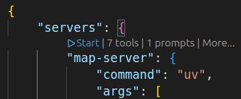

# MCP Map Server

A Model Context Protocol (MCP) server that provides a dynamic map interface. 

## Quick Start

Add the hosted MCP endpoint to your LLM client, like so: 


### Using VSCode

create a  `.vscode/mcp.json` like this: ([as in this repo](.vscode/mcp.json))

```json
{
	"servers": {
		"map-server": {
			"command": "uv",
			"args": [
				"run",
				"mcp-map-server",
				"--transport",
				"stdio",
				"--prompt-file",
				"system-prompt.example.md"
			]
		},
	}
}
```

You should see a little icon appear above the entry to "Start" server, like so: 




### Configuring Data Layer Information

The server supports MCP prompts to provide AI agents with information about available data layers. This helps agents understand which layers are available, their attributes, and how to use them effectively.

**Recommended: Use a Markdown file**

You can provide a system prompt as a plain markdown file:

```bash
mcp-map-server --prompt-file my-layers.md
```

---

## Tooling & API

Every map-modifying tool returns the **full, updated map configuration** in JSON format. 

### Available Tools

- `add_layer`: Adds a raster (XYZ/Tiles) or vector (MVT/PMTiles) layer.
- `set_map_view`: Moves the camera to a specific `center` and `zoom`.
- `filter_layer`: Applies MapLibre filter expressions to an existing layer.
- `set_layer_paint`: Dynamically modifies paint properties (colors, opacity, etc.).
- `remove_layer`: Deletes a layer by ID.
- `get_map_config`: Returns the current session/provided state as JSON.

### MCP Client Configuration

To use this with MCP-compatible clients like Claude Desktop or VSCode extensions, point them to the server.

**Local Development (Recommended):**

Local clients like Claude Desktop and VSCode expect **StdIO** transport when launching a command. The server now defaults to `stdio`.


```json
{
  "mcpServers": {
    "map-server": {
      "command": "uv run mcp-map-server"
    }
  }
}
```

**Passing CLI Arguments (Transport, Prompts, etc.):**

If you need to specify the transport explicitly or provide a custom system prompt file, use the `args` array. 

> [!IMPORTANT]
> Arguments must be passed as individual elements in the `args` array, NOT as part of the `command` string.

```json
{
  "mcpServers": {
    "map-server": {
      "command": "uv run mcp-map-server",
      "args": [
        "--transport", "stdio",
        "--prompt-file", "/path/to/my-layers.md"
      ]
    }
  }
}
```

*Note: The server defaults to `stdio` when run as a command.*

**Using the Shared Production Server:**

Web-based or remote clients connect via **HTTP**.

```json
{
  "mcpServers": {
    "map-server": {
      "url": "https://mcp-map.nrp-nautilus.io/mcp/"
    }
  }
}
```

## License

MIT
